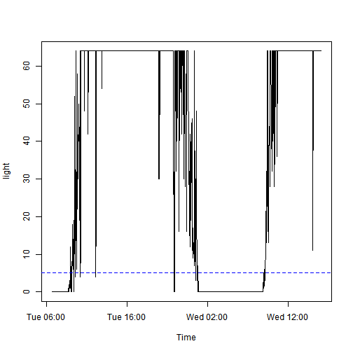
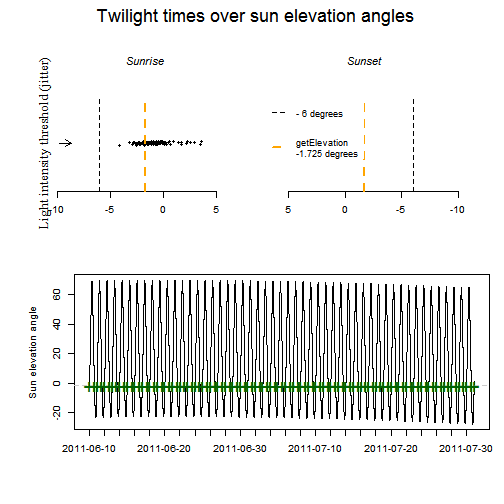
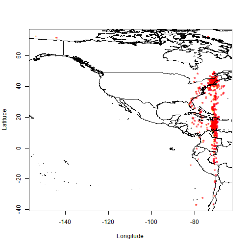
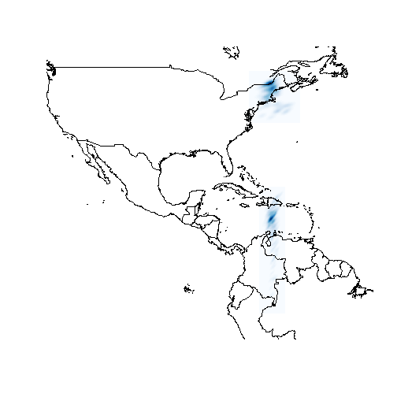
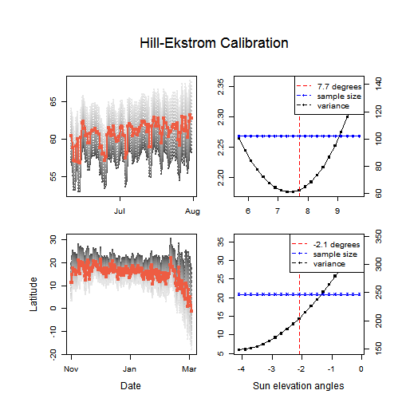
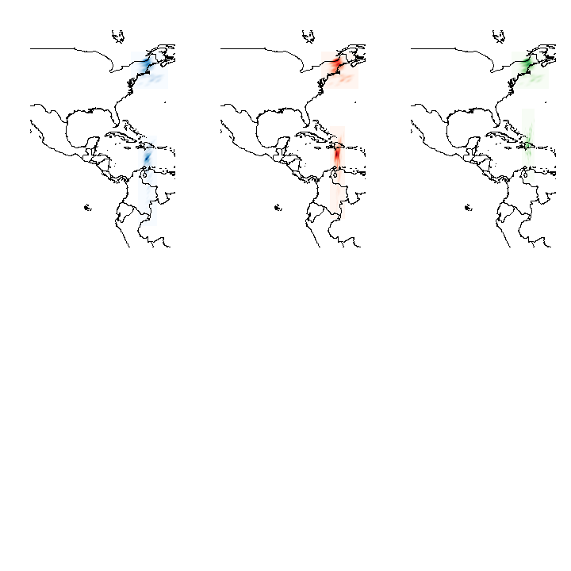

Ecology and Conservation of Migratory Birds
========================================================
Geolocator Analysis Tutorial
--------------------------------------------------------
#### *Prepared by Michael T. Hallworth, Ph.D.*

#### Introduction to Archival light-level geolocators
The following document outlines the steps for analyzing data from archival light-level geolocators (hereafter geolocators). Geolocators have been used to track individuals since the early 1990s but were restricted to large organisms because of their large size. Recently, with the miniturization of geolocators, researchers are now able to deploy geolocators on smaller and smaller species.  Geolocators are devices that record ambient light levels every 2, 5, or 10 min depending on the model. Geolocators are attached to individuals which then migrate with the device while it records ambient light-levels throughout the year. Once recovered, the data are downloaded and analyzed to determine the time of sunrise and sunset. From the sunrise/sunset data the time of relative noon and midnight are determine. Geographical cooridnates are then derived from the relative 'noon' and 'midnight' times to give an approximate location of where the individual was throughout the year.

 

This tutorial uses geolocator data from a male Ovenbird (*Seiurus aurocapilla*) breeding at Hubbard Brook Experimental Forest, NH and a Wood Thrush (*Hylocichla mustelina*) breeding in Indiana and is part of an ongoing study modeling regional source-sink dynamics of a migratory songbird. Click [here](http://nationalzoo.si.edu/scbi/migratorybirds/research/marra/wood-thrush.cfm) for more information regarding the Wood Thrush project. The geolocators used for the two projects were purchased from [British Antarctic Survey](http://www.antarctica.ac.uk/bas_research/instruments/instrument7.php) (BAS) and [Lotek](htt://www.lotek.com/archival-birds.html) (LightBug). These models operate in the same manner but format the data differently. In order to use `GeoLight` to analyze the data, the data needed to be formatted correctly so `GeoLight` can read the data.

#### Analysis of geolocator data using the GeoLight package in R

The following R packages are needed to conduct the tutorial

```r
library(GeoLight)
library(raster)
library(ks)
```

The data format of geolocators purchased from different vendors are slightly different and need to be converted into a file format that is recognized by `GeoLight` 


Ovenbird Raw data from **British Antarctic Survey (.lig file)**

```
##   Valid              Date Julian Light
## 1    ok 07/06/11 09:25:12  40701    44
## 2    ok 07/06/11 09:27:12  40701    64
## 3    ok 07/06/11 09:29:12  40701    64
## 4    ok 07/06/11 09:31:12  40701    64
## 5    ok 07/06/11 09:33:12  40701    64
## 6    ok 07/06/11 09:35:12  40701    64
```
Wood Thrush Raw data from **Lotek LightBug (.txt file)**

```
##    time     date light
## 1 00:07 27/07/11   236
## 2 00:14 27/07/11   236
## 3 00:21 27/07/11   236
## 4 00:28 27/07/11   236
## 5 00:35 27/07/11   236
## 6 00:43 27/07/11   234
```


The following functions were created to convert the different raw data formats into the format needed to process light data in `GeoLight`. The functions need to be added to your R console to use the function. The `source` function is used to read in a function stored as an `R` file in your working directory.

```r
source("read_lig.R")      # function written by Simon Wotherspoon accessed from GitHUB
source("read_Lightbug.R") # read_lig function modified by M.T.Hallworth to read in LightBug data
```

Import .lig file using read.lig fucntion to convert dates that GeoLight recognizes

```r
GL_68517<-read.lig("2391_68517_000.lig") 

head(GL_68517)
```

```
##   Valid                Date Julian Light
## 1    ok 2011-06-07 09:25:12  40701    44
## 2    ok 2011-06-07 09:27:12  40701    64
## 3    ok 2011-06-07 09:29:12  40701    64
## 4    ok 2011-06-07 09:31:12  40701    64
## 5    ok 2011-06-07 09:33:12  40701    64
## 6    ok 2011-06-07 09:35:12  40701    64
```


Now that the data are formatted - you can use `GeoLight` to determine transitions (sunrise/sunset)

In this example - a threshold of 5 was used - a larger value can be used but it will increase the number of transitions that need to be scored.

`LightThreshold` - determines light levels over 5 "sun has risen/set" and asks you to accept/reject them

**Note - determining the transitions in this file took approx. 45mins - 1hr**  

The following code produces an interactive plot which asks the user to either accept or reject each light transition that passes over the threshold specified in the code. This document does not support interactive plots but the plot you will see should look similar to the one below. The blue line identifies the threshold level set in the code.


```r
GL_68517_transitions_example<-twilightCalc2(datetime = GL_68517[,2],
                               light= GL_68517[,4],
                               LightThreshold=5, 
                               ask=TRUE)
```

```
## Error: menu() cannot be used non-interactively
```

 

Once you have gone through the process of accepting or rejecting the transition events the data will look like this. tFirst and tSecond correspond to the time of the transitions and type illustrates whether the location will be dervied from relative 'noon' or 'midnight' locations.  


```r
head(GL_68517_transitions)
```

```
##   X              tFirst             tSecond type
## 1 1 2011-06-10 08:48:00 2011-06-11 00:25:00    1
## 2 2 2011-06-11 00:25:00 2011-06-11 09:05:00    2
## 3 3 2011-06-11 09:05:00 2011-06-12 00:10:00    1
## 4 4 2011-06-12 00:10:00 2011-06-12 09:06:00    2
## 5 5 2011-06-12 09:06:00 2011-06-13 00:31:00    1
## 6 6 2011-06-13 00:31:00 2011-06-13 08:58:00    2
```

#### Sun-elevation angle

The next step is to calculate the sun-elevation angle of a known capture location. The sun-elevation angle is the angle of the sun with respect to the horizon at the time the geolocator light data passed the threshold set by the user. Thus, the sun-elevation angle is unique to the threshold used in the analysis. Here I chose the dates between deployment of the geolocator and July 31 to ensure that only transitions when the bird was at the capture location were used to calculate the sun-elevation angle. 

*The coordinates also need to be entered - (X,Y) in that order*

*This Ovenbird was captured at Hubbard Brook Experimental Forest, NH (-71.45,43.945)*  
 

```r
getElevation(tFirst= GL_68517_transitions[1:102,2],
             tSecond= GL_68517_transitions[1:102,3],
             type=GL_68517_transitions[1:102,4],
             known.coord=c(-71.45,43.945),
             plot=TRUE)
```

 

```
## [1] -1.725
```


#### location estimates assuming no change in sun elevation angle throughout the year  


```r
GL_68517Locations<-coord(tFirst= GL_68517_transitions[,2],
                         tSecond= GL_68517_transitions[,3],
                         type=GL_68517_transitions[,4], 
                         degElevation=-1.725)
```

```
## Note: Out of 672 twilight pairs, the calculation of 36 latitudes failed (5 %)
```

```r
head(GL_68517Locations)
```

```
##              [,1]        [,2]
## [1,] -69.13820419 43.89800599
## [2,] -71.36280155 41.69583778
## [3,] -69.33777381 39.26762099
## [4,] -69.56222170 39.24201917
## [5,] -72.03614924 42.10141115
## [6,] -71.01039142 43.42025702
```


#### Plot the location data
 


#### Create Kernel Density Estimates (KDE) around the stationary periods 

The following packages were used to create KDE of stationary periods

```r
library(ks)
library(raster)
library(RColorBrewer)
```
Breeding locations were determined using location data described earlier in determining the sun-elevation angle.The non-breeding period determined as 1 November - 3 March (the start of spring Equinox period). See Hallworth et al. in press for details.


```r
breeding_68517<-data.frame(GL_68517Locations[1:102,1],GL_68517Locations[1:102,2])
NB_68517<-data.frame(GL_68517Locations[288:534,1],GL_68517Locations[288:534,2])
```

Determine bandwidth for the Kernel density estimate - the bandwidth parameter sets the 'smoothness' of the KDE. The bandwidth was estimated using least-square cross validation.

```r
Bwidth<-Hlscv(breeding_68517)
NBwidth<-Hlscv(NB_68517)
```
The following script creates the KDE and converts the KDE to a raster.

```r
Breeding_KDE<-raster(kde(x=breeding_68517,H=Bwidth)) 
NonBreeding_KDE<-raster(kde(x=NB_68517,H=NBwidth))
```

Plot the results - *not elegant but you can dress it up from here anyway you want*

 

### Using different sun-elevation angles for different periods of the annual cycle

Notice in the above figure how the non-breeding KDE is exclusively over the Caribbean and does not fall over land. The sun-elevation angle (described above) can make a big difference in the latitude of the locations. The sun-elevation angle can be influenced by a variatey of factors such as habitat type, topography, weather, and bird behavior. Thus, using multiple sun-elevation angles for different portions of the year may be justified. The following code demonstrates how the sun-elevation angle for different portions of the year can be determined. Few studies have in-habitat calibrations for both breeding and non-breeding periods of the year (but see Hallworth et al. in press, Stanley et al. 2014, McKinnon et al. 2013). Thus the sun-elevation angle for different portions of the year need to be estimated. In `GeoLight` there is a function called `HillEkstromCalib` which determines the sun-elevation angle based on the transition events in the data. 

In the following example the different periods of the year are determined manually based on the natural history of Ovenbirds

Create empty column to later fill with numeric values for period - 


```r
GL_68517_transitions$period<-rep(NA,672)

head(GL_68517_transitions)
```

```
##   X              tFirst             tSecond type period
## 1 1 2011-06-10 08:48:00 2011-06-11 00:25:00    1     NA
## 2 2 2011-06-11 00:25:00 2011-06-11 09:05:00    2     NA
## 3 3 2011-06-11 09:05:00 2011-06-12 00:10:00    1     NA
## 4 4 2011-06-12 00:10:00 2011-06-12 09:06:00    2     NA
## 5 5 2011-06-12 09:06:00 2011-06-13 00:31:00    1     NA
## 6 6 2011-06-13 00:31:00 2011-06-13 08:58:00    2     NA
```
Define Breeding based on natural history of species  
Ideally this would be done based on the biology (breeding season) and so on

breeding period = from capture to July 31

non-breeding period= 1 Nov - 31 March

*see Hallworth et al. in press for details* 

Assign a stationary period to the transition data

0= Migratory Period, 1=Breeding, 2=Non-breeding 

```r
names(GL_68517_transitions)
```

```
## [1] "X"       "tFirst"  "tSecond" "type"    "period"
```

```r
GL_68517_transitions[1:102,5]<-1
GL_68517_transitions[103:287,5]<-0
GL_68517_transitions[288:534,5]<-2
GL_68517_transitions[535:672,5]<-0
```

Generate sun-elevation angles for different periods of the year using Ekstrom-Hill calibration   
Generates a sun-elevation angle for all non-zero periods 

```r
HillEkstromCalib(tFirst= GL_68517_transitions[,2],
                 tSecond= GL_68517_transitions[,3],
                 type=GL_68517_transitions[,4],
                 site=GL_68517_transitions[,5],
                 start.angle=c(0,-3), #angle to start  process c(breeding,nonbreeding)
                 plot=TRUE)
```

 

```
## [1]  7.7 -2.1
```

Define a column using the sun elevation angles generated

```r
GL_68517_transitions$sun<-rep(NA,672)
```

Fill the new column using the sun-elevation angle for the known location (breeding = -1.725) and Ekstrom-Hill calibration for unknown locations (non-breeding = -2.1)


```r
names(GL_68517_transitions)
```

```
## [1] "X"       "tFirst"  "tSecond" "type"    "period"  "sun"
```

```r
GL_68517_transitions[1:102,6]<-(-1.725)
GL_68517_transitions[103:287,6]<-(0) # Migration values are zero in this example
GL_68517_transitions[288:534,6]<-(-2.1)
GL_68517_transitions[535:672,6]<-(0) # Migration values are zero in this example
```

**Note** - *One could treat migration points differently - for example, the midpoint*
*between breeding and non-breeding sun elevations could be used as a*
*transition period (this would need to be justified in your manuscript)*
*or you could use either the breeding or non-breeding sun angle but also*
*would need to be justified.* 


Generate new location data based on newly derived sun-elevation angles 

```r
GL_68517LocationsEHC<-coord(tFirst= GL_68517_transitions[,2],
                        tSecond= GL_68517_transitions[,3],
                        type=GL_68517_transitions[,4], 
                        degElevation=GL_68517_transitions$sun,
                        sites=GL_68517_transitions[,5])
```

```
## Note: Out of 672 twilight pairs, the calculation of 0 latitudes failed (0 %)
```

#### Plot the new location data
Left = Single sun-elevation angle (-1.725)

Middle = Non-breeding sun-elevation angle determined using Esktrom-Hill calibration (-2.1)

Right = Non-breeding sun-elevation angle determined using in-habitat calibration (-3.4) (not shown)
*Hallworth et al. in press*


 


